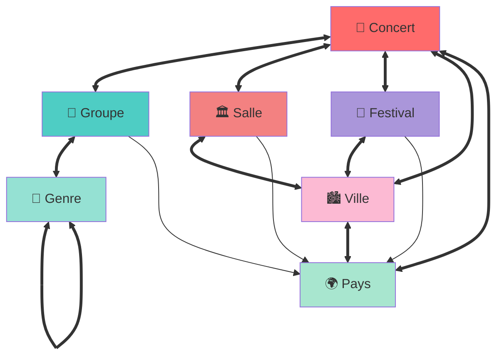

# 🔗 Relationship Map

Visual guide to all relationships in the vault's relational database system.

## Entity Relationship Diagram



## ASCII Diagram

```
                    🌍 PAYS
                      │
        ┌─────────────┼─────────────┐
        │             │             │
        ↓             ↓             ↓
    🏙️ VILLE ←──→ 🎪 FESTIVAL   🎤 GROUPE
        │             │             │
        ↓             ↓             ↓
    🏛️ SALLE ←──────┼─────────→ 🎵 GENRE
        │             │             ↕
        └──────→  🎸 CONCERT ←──────┘
                      ↕
                [All Entities]
```

## Relationship Details

### Concert Relations

**Outgoing (Bidirectional):**
- `concert-groupes` → **Groupe** (many)
  - Inverse: `groupe-concerts`
  - Example: "Iron Maiden" concert links to Iron Maiden band page
  
- `concert-salle` → **Salle** (one)
  - Inverse: `salle-concerts`
  - Example: Concert at "Brin de Zinc" links to venue page
  
- `concert-festival` → **Festival** (one)
  - Inverse: `festival-editions`
  - Example: "Hellfest 2024" concert links to Hellfest page
  
- `concert-ville` → **Ville** (one)
  - Inverse: `ville-concerts`
  - Example: Concert in "Lyon" links to Lyon city page
  
- `concert-pays` → **Pays** (one)
  - Inverse: `pays-concerts`
  - Example: Concert in "France" links to France country page

**Auto Relations:**
- `concert-same-night`: Concerts on the same date
- `concert-same-venue`: Concerts at the same venue

### Groupe Relations

**Outgoing:**
- `groupe-concerts` → **Concert** (many)
  - Lists all concerts where this artist performed
  
- `groupe-genres` → **Genre** (many, bidirectional)
  - Inverse: `genre-groupes`
  - Example: "Tool" links to ["Progressive Metal", "Alternative Metal"]
  
- `groupe-origine` → **Pays** (one)
  - Inverse: `pays-groupes-origine`
  - Example: "Ange" originates from "France"

**Auto Relations:**
- `groupe-similar`: Similar artists based on Jaccard similarity
  - Algorithm: Compare shared genres + concerts
  - Threshold: ≥ 0.3 similarity score
  - Example: Opeth ↔ Gojira (both prog metal, similar concert history)
  
- `groupe-tour-together`: Artists that toured together
  - Criteria: 3+ shared concert dates
  - Example: Iron Maiden + Saxon (toured together 5 times)

### Genre Relations

**Outgoing:**
- `genre-parent` → **Genre** (one, bidirectional)
  - Inverse: `genre-children`
  - Example: "Death Metal" parent is "Metal"
  
- `genre-children` → **Genre** (many)
  - Inverse: `genre-parent`
  - Example: "Metal" has children ["Heavy Metal", "Death Metal", "Black Metal"]
  
- `genre-related` → **Genre** (many, bidirectional)
  - Similar genres (non-hierarchical)
  - Example: "Doom Metal" ↔ "Sludge Metal"
  
- `genre-groupes` → **Groupe** (many)
  - Inverse: `groupe-genres`
  - All artists in this genre

**Auto Relations:**
- `genre-co-occurrence`: Genres that appear together
  - Criteria: Same artists or shared concerts (3+ times)
  - Example: "Progressive Rock" + "Symphonic Rock" (often together)

### Salle Relations

**Outgoing:**
- `salle-concerts` → **Concert** (many)
  - All concerts at this venue
  
- `salle-ville` → **Ville** (one, bidirectional)
  - Inverse: `ville-salles`
  - Example: "Brin de Zinc" is in "Lyon"
  
- `salle-pays` → **Pays** (one)
  - Inverse: `pays-salles`
  - Example: "L'Olympia" is in "France"

**Auto Relations:**
- `salle-nearby`: Venues in the same city
  - Example: "Le Sucre" ↔ "Brin de Zinc" (both in Lyon)

### Festival Relations

**Outgoing:**
- `festival-editions` → **Concert** (many)
  - All concerts/editions of this festival
  
- `festival-ville` → **Ville** (one, bidirectional)
  - Inverse: `ville-festivals`
  - Example: "Hellfest" is in "Clisson"
  
- `festival-pays` → **Pays** (one)
  - Inverse: `pays-festivals`
  - Example: "Roadburn" is in "Pays-Bas"

**Auto Relations:**
- `festival-concurrent`: Festivals with overlapping dates
  - Example: "Hellfest" overlaps with "Download Festival"

### Ville Relations

**Outgoing:**
- `ville-pays` → **Pays** (one, bidirectional)
  - Inverse: `pays-villes`
  - Example: "Lyon" is in "France"
  
- `ville-salles` → **Salle** (many)
  - Inverse: `salle-ville`
  - All venues in this city
  
- `ville-festivals` → **Festival** (many)
  - Inverse: `festival-ville`
  - All festivals in this city
  
- `ville-concerts` → **Concert** (many)
  - Inverse: `concert-ville`
  - All concerts in this city

### Pays Relations

**Outgoing:**
- `pays-villes` → **Ville** (many)
  - Inverse: `ville-pays`
  - All cities in this country
  
- `pays-salles` → **Salle** (many)
  - Inverse: `salle-pays`
  - All venues in this country
  
- `pays-festivals` → **Festival** (many)
  - Inverse: `festival-pays`
  - All festivals in this country
  
- `pays-concerts` → **Concert** (many)
  - Inverse: `concert-pays`
  - All concerts in this country
  
- `pays-groupes-origine` → **Groupe** (many)
  - Inverse: `groupe-origine`
  - All artists originating from this country

## Relationship Algorithms

### Jaccard Similarity (for `groupe-similar`)

Calculates similarity between two artists based on shared attributes:

```
J(A, B) = |A ∩ B| / |A ∪ B|
```

Applied to:
- Shared genres
- Shared concerts
- Combined score ≥ 0.3 → Similar

**Example:**
```
Artist A: genres=[Metal, Progressive], concerts=[C1, C2, C3]
Artist B: genres=[Progressive, Rock], concerts=[C2, C3, C4]

Genre similarity: 1/3 = 0.33
Concert similarity: 2/4 = 0.50
Combined: (0.33 + 0.50) / 2 = 0.415 → SIMILAR ✓
```

### Co-occurrence (for `genre-co-occurrence`)

Identifies genres that frequently appear together:

```
Count concerts where both Genre A and Genre B appear
If count ≥ 3 → Co-occurrence relationship
```

**Example:**
```
"Progressive Metal" + "Death Metal" appear together in:
- Opeth concert
- Gojira concert
- Mastodon concert
→ 3 occurrences → RELATED ✓
```

### Tour Together (for `groupe-tour-together`)

Identifies artists that have toured together:

```
Count shared concert dates for Artist A and Artist B
If count ≥ 3 → Tour together relationship
```

**Example:**
```
"Iron Maiden" and "Saxon" shared concerts:
- 2024-06-15 Festival
- 2023-07-20 Arena Tour
- 2023-07-22 Arena Tour
- 2022-08-10 Festival
→ 4 shared concerts → TOURED TOGETHER ✓
```

## Bidirectionality

### How It Works

When you create a link in one direction, the system automatically creates the inverse link:

```yaml
# In Concert file:
groupes: ["Iron Maiden"]

# System automatically adds to Iron Maiden file:
groupe-concerts: ["2024-06-15 - Download Festival"]
```

### Maintenance

Use `tools/sync-graph.py` to:
- Check all bidirectional relations
- Repair missing inverse links
- Ensure consistency

### Validation

Use `tools/validate-schema.py` to:
- Verify all inverse relations exist
- Detect broken links
- Report inconsistencies

## Working with Relations

### Adding Relations Manually

In frontmatter:
```yaml
---
type: concert
groupes: ["Band A", "Band B"]
salle: Venue Name
ville: City Name
---
```

### Automatic Relations

Run `tools/build-relations.py` to:
- Calculate similarity scores
- Identify co-occurrences
- Create auto-relations
- Update frontmatter

### Querying Relations

Using Dataview in Obsidian:
```dataview
TABLE groupe-concerts as "Concerts"
FROM "Musique/Groupes"
WHERE contains(groupe-genres, "Progressive Metal")
```

## Visualizing Relations

### In Graph View

1. Open Graph View (Ctrl/Cmd + G)
2. Enable filters for specific types
3. See connections based on:
   - Wiki links `[[Page]]`
   - Frontmatter relations
   - Bidirectional links

### Using Colors

Entity types have distinct colors:
- 🎸 Concert: `#FF6B6B` (red)
- 🎤 Groupe: `#4ECDC4` (cyan)
- 🎵 Genre: `#95E1D3` (mint)
- 🏛️ Salle: `#F38181` (pink)
- 🎪 Festival: `#AA96DA` (purple)
- 🏙️ Ville: `#FCBAD3` (rose)
- 🌍 Pays: `#A8E6CF` (green)

## Example Queries

### Find Similar Artists

```python
# Using build-relations.py
python tools/build-relations.py --vault .
# Creates groupe-similar relations automatically
```

### Find Co-occurring Genres

```python
# Genres that appear together frequently
python tools/build-relations.py --vault .
# Creates genre-co-occurrence relations
```

### List All Concerts in a City

In Dataview:
```dataview
LIST
FROM "Musique/Concerts"
WHERE contains(ville, "Lyon")
SORT date DESC
```

## See Also

- [SCHEMA.md](SCHEMA.md) - Complete schema documentation
- [GRAPH-GUIDE.md](GRAPH-GUIDE.md) - Graph View guide
- [README-RELATIONS.md](../README-RELATIONS.md) - User guide
